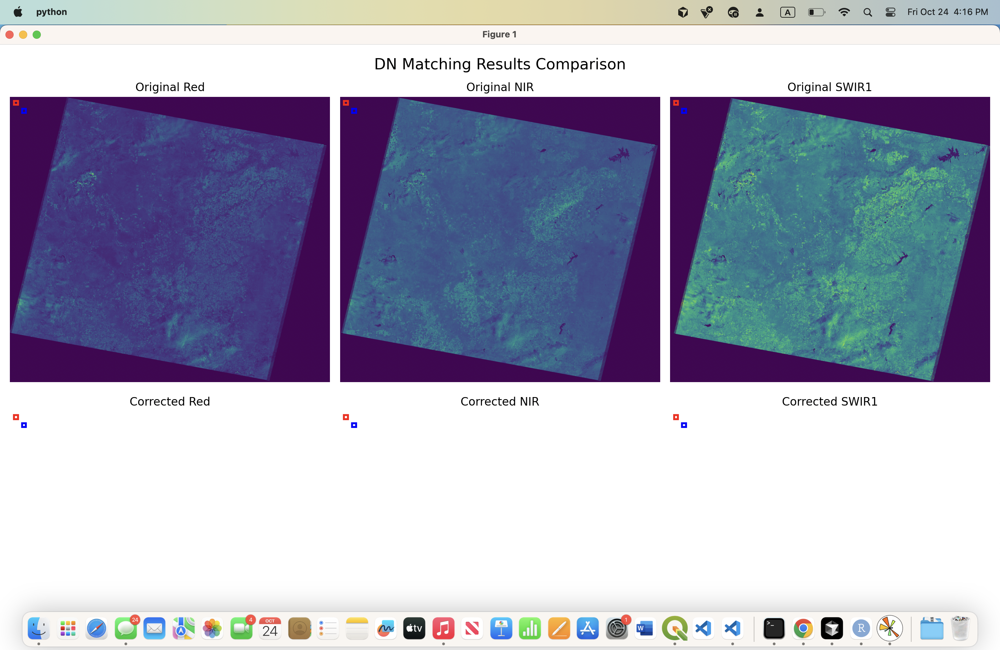

# Lab 03 Assignment 5: Methodology and Results

## Assignment 1: Spectral Indices Calculation

### Methodology Overview
The script automatically processes two Landsat-5 images to calculate SAVI (Soil Adjusted Vegetation Index) and NDSI (Normalized Difference Snow Index) using band math operations.

### Key Steps:
1. **Automated File Processing**: Script loops through both Landsat-5 images (`LT50290372010217EDC00` and `LT50290372010233EDC00`)
2. **Band Reading**: Extracts individual bands (B2=Green, B3=Red, B4=NIR, B5=SWIR1) from each image
3. **Spectral Index Calculation**:
   - **SAVI**: `((NIR - Red) / (NIR + Red + L)) * (1 + L)` where L=0.5 (soil brightness correction)
   - **NDSI**: `(Green - SWIR) / (Green + SWIR)`
4. **Division by Zero Protection**: Uses `np.where()` to handle potential zero denominators
5. **Georeferenced Output**: Saves results as GeoTIFF files with proper projection and geotransform

### Script Functions:
- `read_geotiff_band()` - Reads individual bands with metadata
- `write_geotiff()` - Saves processed data with georeferencing
- `calculate_savi()` - Computes SAVI with soil adjustment
- `calculate_ndsi()` - Computes NDSI for snow detection
- `process_landsat_image()` - Main processing function for each image

### Results Generated:
- 4 spectral index files (2 SAVI + 2 NDSI)
- Proper file naming: `{ImageName}_{Index}.TIF`
- QGIS-ready GeoTIFF format


---

## Assignment 2: DN Matching for Radiometric Correction

### Methodology Overview
Performs radiometric correction between two Landsat-5 images using DN (Digital Number) matching to make them comparable for temporal analysis.

### Key Steps:
1. **Band Stacking**: Combines Red (B3), NIR (B4), and SWIR1 (B5) bands into multi-band GeoTIFF
2. **Stable Area Selection**: Identifies dark and bright stable regions that remain constant between dates
3. **Statistical Analysis**: Calculates average DN values for stable areas in both images
4. **Linear Regression**: Computes correction parameters using two-point method
5. **DN Correction**: Applies linear transformation: `New_DN = slope × Original_DN + intercept`

### Mathematical Approach:
- **Two-Point Linear Regression**: Uses dark and bright stable areas as control points
- **Slope Calculation**: `a = (y2 - y1) / (x2 - x1)` where y=target, x=reference
- **Intercept Calculation**: `b = y1 - a × x1`
- **Correction Formula**: `Corrected_DN = a × Original_DN + b`

### Script Functions:
- `stack_bands()` - Creates multi-band GeoTIFF files
- `clip_stable_areas()` - Extracts dark and bright regions
- `calculate_linear_regression()` - Computes slope and intercept
- `apply_dn_correction()` - Applies radiometric correction
- `process_dn_matching()` - Main orchestration function

### Results Generated:
- 3 corrected band files (Red, NIR, SWIR1)
- Comparison visualization with stable area markers
- Statistical analysis of correction parameters



---

## Technical Implementation Details

### Error Handling:
- Division by zero protection using `np.where()`
- File existence validation
- NoData value handling
- Exception handling for robust processing

### Performance Optimizations:
- Efficient array operations with NumPy
- Memory management with dataset cleanup
- Batch processing for multiple images

### Output Quality:
- High-resolution visualization (300 DPI)
- Proper georeferencing preservation
- GeoTIFF format for GIS compatibility
- Statistical validation of results

---

## File Structure
```
assignment_5/
├── Lab03_assignment1.py          # SAVI/NDSI calculation script
├── Lab03_assignment2.py          # DN matching script
├── README.md                     # Project overview
├── METHODOLOGY.md               # This file
├── assignment_5_output/         # Assignment 1 results
│   ├── LT50290372010217EDC00_SAVI.TIF
│   ├── LT50290372010217EDC00_NDSI.TIF
│   ├── LT50290372010233EDC00_SAVI.TIF
│   └── LT50290372010233EDC00_NDSI.TIF
├── assignment_2_output/         # Assignment 2 results
│   ├── dn_matching_comparison.png
│   ├── LT50290372010233EDC00_corrected_Red.TIF
│   ├── LT50290372010233EDC00_corrected_NIR.TIF
│   └── LT50290372010233EDC00_corrected_SWIR1.TIF
└── screenshots/                 # Upload your QGIS screenshots here
    ├── savi_results.png
    ├── ndsi_results.png
    ├── dn_matching_comparison.png
    └── qgis_analysis.png
```

---

## Next Steps for Submission:
1. **Upload QGIS Screenshots**: Add your screenshots to the `screenshots/` folder
2. **Update Captions**: Modify the screenshot captions with your specific observations
3. **GitHub Push**: Commit and push the complete `assignment_5/` folder to your repository
4. **Documentation**: Ensure all results are properly documented and visualized
